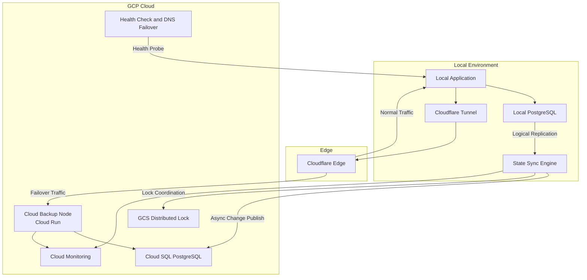

# Cloud Mirror

Cloud Mirror is a research-driven systems project that explores a practical question: how can a local-first application stay inexpensive during normal operation, yet still fail over to the cloud when the local node goes down?

The project proposes a headless failsafe layer for existing applications and PostgreSQL databases. Instead of asking developers to rewrite their services, Cloud Mirror adds replication, health monitoring, traffic redirection, and split-brain protection around the application that already exists. The result is a cost-aware backup architecture that keeps the cloud path idle most of the time, then activates it only when the local system becomes unavailable.

## Abstract

Cloud Mirror combines three ideas into one resilient workflow:

- a standalone Go-based State Sync Engine that streams PostgreSQL changes from local to cloud
- a scale-to-zero cloud backup node built on Cloud Run and Cloud SQL
- DNS- and health-check-based failover that redirects traffic when the local application is unhealthy

This repository frames high availability as a systems design problem rather than an application rewrite problem. The core research contribution is an architecture that aims to balance availability, low idle cost, operational simplicity, and compatibility with existing software stacks.

## Problem Statement

Many small teams and student projects run reliably on a local or self-hosted primary environment, but traditional high-availability patterns often assume an always-on cloud replica, permanent standby compute, and deeper application-level changes. That raises both cost and complexity.

Cloud Mirror investigates a different model:

- keep the primary application local during normal operation
- continuously mirror database state to the cloud
- maintain a cold or near-cold backup path with scale-to-zero compute
- automatically promote the cloud path when the local service fails
- prevent both sides from accepting writes at the same time

## Design Goals

- **Non-invasive integration**: work with an existing application and PostgreSQL database without schema rewrites or framework lock-in
- **Low idle cloud cost**: keep backup compute at zero running instances until failover is needed
- **Automatic failover**: detect local outages and redirect traffic to the cloud path without manual intervention
- **Data continuity**: replicate database updates asynchronously with visible lag metrics and recovery coordination
- **Single-writer safety**: avoid split-brain conditions through distributed locking and database mode transitions
- **Operational visibility**: expose logs, metrics, and status endpoints for monitoring and debugging

## Key Features

- **Language-agnostic architecture**  
  The local application is treated as a black box. Cloud Mirror integrates beside it rather than inside it.

- **PostgreSQL logical replication pipeline**  
  The State Sync Engine subscribes to local database changes and publishes them to the cloud database asynchronously.

- **Scale-to-zero cloud backup node**  
  The cloud application runs on Google Cloud Run with `min_instance_count = 0`, so compute cost stays minimal while the local system is healthy.

- **Automatic DNS failover**  
  Health checks detect local outages and shift traffic toward the cloud backup route.

- **Split-brain prevention**  
  A distributed lock in Google Cloud Storage coordinates the active writer and supports read-only transitions during failover.

- **Observability by design**  
  Structured logs, Prometheus metrics, and a JSON status endpoint make replication and failover behavior measurable.

- **Infrastructure as code**  
  Terraform modules provision the network, database, compute, DNS, storage, and monitoring components required for the backup environment.

## System Architecture



### Core Components

- **State Sync Engine**  
  A standalone Go service responsible for logical replication, retry handling, replication state persistence, metrics, status reporting, and failover coordination.

- **Cloud Backup Node**  
  A containerized version of the developer's application deployed to Cloud Run and connected to a mirrored Cloud SQL instance.

- **Health Monitoring and Failover Layer**  
  DNS routing and health checks that determine when to keep traffic local and when to switch users to the cloud backup.

- **Distributed Lock Service**  
  A lease-based lock stored in GCS that helps ensure only one side is treated as the active writer during failover and recovery.

## System Workflow

### 1. Normal Operation

- the local application serves production traffic
- the local PostgreSQL instance accepts writes
- the State Sync Engine streams changes to Cloud SQL
- the cloud backup application remains scaled to zero
- health checks continuously validate the local endpoint

### 2. Failover

- health checks observe repeated local failures
- DNS policy shifts traffic toward the cloud backup path
- Cloud Run scales from zero to active instances
- the State Sync Engine coordinates lock ownership
- the local database is marked read-only when possible
- the cloud node begins serving traffic from mirrored data

### 3. Recovery

- the local application becomes healthy again
- cloud-side changes are synchronized back to local
- the local database is verified before traffic returns
- DNS shifts traffic back to the local environment
- the cloud backup scales back down after idle time

## Important Engineering Tradeoff

Cloud Mirror is intentionally designed around **eventual consistency**, not synchronous replication. That tradeoff is what makes the architecture lightweight and cost-aware, but it also means the cloud backup may be slightly stale at failover time. The project therefore treats **replication lag**, **failover time**, and **single-writer coordination** as first-class operational concerns.

## Why This Project Matters

Cloud Mirror is useful as both a prototype and a research artifact because it explores an unusual but practical availability model:

- it separates resilience infrastructure from application business logic
- it shows how local-first systems can still adopt cloud backup patterns
- it reduces the need for an always-on warm standby environment
- it makes operational safety measurable through metrics and explicit coordination logic
- it offers a reproducible blueprint through code, Terraform modules, and design documentation

## Repository Structure

```text
.
├── docs/                  # Requirements, design, and implementation planning
├── state-sync-engine/     # Go service for replication, coordination, and observability
└── terraform/             # GCP infrastructure modules and root deployment config
```

### Module Overview

- `docs/requirements.md` defines the system requirements and acceptance criteria
- `docs/design.md` describes the architecture, interfaces, and deployment model
- `docs/tasks.md` tracks implementation progress and remaining work
- `state-sync-engine/` contains the Go implementation of the replication and failover engine
- `terraform/` contains reusable infrastructure modules for network, database, compute, DNS, storage, and monitoring

## Current Implementation Status

The repository already includes substantial core functionality:

- configuration loading and validation
- PostgreSQL logical replication subscriber and cloud publisher
- distributed locking through Google Cloud Storage
- read-only and read-write state coordination
- replication state persistence for restart recovery
- retry logic, backoff, and circuit breaker behavior
- structured logging, Prometheus metrics, and status endpoints
- failover and recovery coordination logic
- Terraform modules for GCP infrastructure and monitoring
- TLS and IAM-focused security hardening

The project is still best described as a **research prototype / advanced systems project** rather than a finished production platform. Remaining work is concentrated in broader testing, deployment artifacts, and additional operator-facing documentation.

## Documentation Guide

- [Requirements Document](docs/requirements.md)
- [Design Document](docs/design.md)
- [Implementation Tasks](docs/tasks.md)
- [State Sync Engine README](state-sync-engine/README.md)
- [Example Engine Configuration](state-sync-engine/config.example.yaml)
- [Terraform Example Variables](terraform/terraform.tfvars.example)

## Technology Stack

- **Language**: Go
- **Database replication**: PostgreSQL logical replication via `pgx/v5`
- **Cloud runtime**: Google Cloud Run
- **Cloud database**: Google Cloud SQL for PostgreSQL
- **Edge exposure**: Cloudflare Tunnel
- **Traffic steering**: health checks plus DNS failover
- **Locking**: Google Cloud Storage
- **Monitoring**: Prometheus metrics and Google Cloud Monitoring
- **Infrastructure provisioning**: Terraform

## Getting Started

### 1. Read the project docs

Start with the documents in `docs/` to understand the intended architecture and implementation scope.

### 2. Explore the State Sync Engine

```bash
cd state-sync-engine
go build ./cmd/state-sync
```

Review `config.example.yaml` for the expected runtime configuration.

### 3. Review the infrastructure layer

```bash
cd terraform
terraform init
```

Use `terraform.tfvars.example` as the starting point for environment-specific values such as project ID, region, database settings, and application image.

## Scope and Limitations

- the current design is centered on PostgreSQL rather than multiple database engines
- failover speed depends on health-check timing, DNS behavior, and cold-start characteristics
- asynchronous replication means some bounded staleness is possible during failover
- some optional tests, packaging work, and integration guides are still marked incomplete in `docs/tasks.md`

## Future Work

- deeper end-to-end failover testing under load
- stronger recovery validation and conflict-handling policies
- deployment scripts and CI/CD automation
- richer operational runbooks and Cloudflare integration guides
- formal evaluation of failover latency, replication lag, and idle cost savings

## License

This project is licensed under the terms of the [MIT License](LICENSE).
