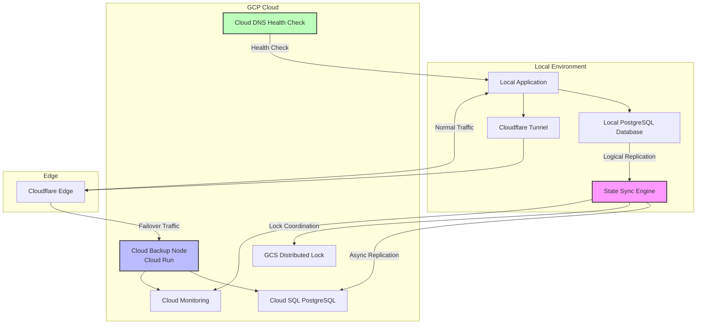

# Design Document: Cloud Mirror

## Overview

This design describes a headless failsafe infrastructure that provides 100% uptime with zero cloud costs during idle states. The system integrates with existing local applications and PostgreSQL databases, providing automatic failover to a cloud backup node while maintaining data consistency through asynchronous replication.

The architecture consists of three primary components:

1. **State Sync Engine**: A standalone Go service that monitors the local PostgreSQL database using logical replication and asynchronously replicates changes to the cloud backup node
2. **Cloud Backup Node**: GCP infrastructure (Cloud Run + Cloud SQL) that mirrors the local application and database, scaling to zero during normal operation
3. **Health Monitoring & Failover**: DNS-based health checks and traffic routing that automatically redirects to the cloud backup when the local application fails

The system is designed to be language-agnostic and non-invasive - it works with any existing application and database without requiring code changes or schema modifications.

## Architecture

### System Components



### Component Responsibilities

**State Sync Engine (Go Service)**
- Connects to local PostgreSQL as a logical replication subscriber
- Captures change events (INSERT, UPDATE, DELETE) from configured tables
- Queues and transmits changes to Cloud SQL asynchronously
- Manages distributed lock for split-brain prevention
- Coordinates read-only mode transitions during failover
- Exposes metrics and status endpoints
- Handles graceful shutdown with replication position persistence

**Cloud Backup Node (GCP Cloud Run)**
- Runs containerized version of the developer's application
- Configured with `min_instances: 0` for scale-to-zero
- Connects to Cloud SQL instead of local database
- Activates automatically when DNS failover occurs
- Serves requests using mirrored database state

**Health Monitor (GCP Cloud DNS)**
- Performs periodic health checks against local application
- Detects consecutive failures indicating local outage
- Triggers DNS-based traffic redirection to Cloud Backup Node
- Monitors recovery and redirects traffic back to local

**Distributed Lock (GCS)**
- Single source of truth for active writer designation
- Prevents split-brain conditions where both nodes accept writes
- Implements lease-based locking with automatic expiration
- Coordinates state transitions during failover and recovery

### Data Flow

**Normal Operation (Local Active)**
1. Local application serves all traffic via Cloudflare Tunnel
2. Local database accepts all writes
3. State Sync Engine streams changes to Cloud SQL
4. Cloud Backup Node scaled to zero (no cost)
5. Health checks continuously validate local application

**Failover (Cloud Active)**
1. Health checks detect local application failure
2. DNS redirects traffic to Cloud Backup Node
3. Cloud Run scales from zero to active instances
4. State Sync Engine acquires distributed lock
5. State Sync Engine coordinates marking local database read-only (if accessible)
6. Cloud Backup Node serves requests using mirrored data
7. Replication lag determines data staleness (eventual consistency)

**Recovery (Return to Local)**
1. Health checks detect local application recovery
2. State Sync Engine synchronizes any cloud-side changes to local
3. State Sync Engine releases distributed lock
4. DNS redirects traffic back to local application
5. Cloud Backup Node scales back to zero

## Components and Interfaces

### State Sync Engine

**Technology Stack**
- Language: Go 1.21+
- PostgreSQL Driver: `github.com/jackc/pgx/v5` (native logical replication support)
- Logging: go.uber.org/zap (structured JSON logging)
- Configuration: github.com/spf13/viper (env vars + YAML/JSON)


**Core Interfaces**

```go
// ReplicationSubscriber manages logical replication from local PostgreSQL
type ReplicationSubscriber interface {
    // Connect establishes replication connection and creates slot if needed
    Connect(ctx context.Context, config DBConfig) error
    
    // Subscribe starts consuming change events from the replication slot
    Subscribe(ctx context.Context, slotName string, tables []string) (<-chan ChangeEvent, error)
    
    // Acknowledge confirms processing of changes up to LSN
    Acknowledge(ctx context.Context, lsn LSN) error
    
    // Close gracefully shuts down replication connection
    Close() error
}

// ChangeEvent represents a single database modification
type ChangeEvent struct {
    LSN       LSN           // Log Sequence Number for ordering
    Timestamp time.Time     // When change occurred
    Table     string        // Fully qualified table name
    Operation Operation     // INSERT, UPDATE, DELETE
    OldRow    map[string]any // Previous values (UPDATE/DELETE)
    NewRow    map[string]any // New values (INSERT/UPDATE)
}

// ReplicationPublisher transmits changes to cloud database
type ReplicationPublisher interface {
    // Publish sends a batch of changes to cloud database
    Publish(ctx context.Context, events []ChangeEvent) error
    
    // HealthCheck verifies cloud database connectivity
    HealthCheck(ctx context.Context) error
}

// DistributedLock coordinates active writer designation
type DistributedLock interface {
    // Acquire attempts to obtain the lock with TTL
    Acquire(ctx context.Context, lockKey string, ttl time.Duration) (bool, error)
    
    // Renew extends the lock lease
    Renew(ctx context.Context, lockKey string, ttl time.Duration) error
    
    // Release gives up the lock
    Release(ctx context.Context, lockKey string) error
    
    // GetHolder returns current lock holder identifier
    GetHolder(ctx context.Context, lockKey string) (string, error)
}

// StateCoordinator manages database read-only transitions
type StateCoordinator interface {
    // SetReadOnly marks a database as read-only
    SetReadOnly(ctx context.Context, db DBConfig) error
    
    // SetReadWrite enables writes on a database
    SetReadWrite(ctx context.Context, db DBConfig) error
    
    // GetState returns current read/write state
    GetState(ctx context.Context, db DBConfig) (DatabaseState, error)
}
```

**Configuration Structure**

```yaml
# config.yaml
local_database:
  host: localhost
  port: 5432
  database: myapp
  user: replicator
  password: ${LOCAL_DB_PASSWORD}
  ssl_mode: require
  replication_slot: failsafe_slot

cloud_database:
  host: 10.0.0.3
  port: 5432
  database: myapp
  user: replicator
  password: ${CLOUD_DB_PASSWORD}
  ssl_mode: require

replication:
  tables:
    - public.users
    - public.orders
    - public.sessions
  batch_size: 100
  flush_interval: 1s
  max_lag_seconds: 30

distributed_lock:
  gcs_bucket: failsafe-locks
  lock_key: active-writer
  ttl: 30s
  renew_interval: 10s

health:
  status_port: 8080
  metrics_port: 9090
  check_interval: 10s

failover:
  timeout: 60s
  consecutive_failures: 3
```

**Metrics Exposed**

```
# Replication metrics
state_sync_replication_lag_seconds - Current replication lag
state_sync_events_processed_total - Total change events processed
state_sync_events_failed_total - Failed replication attempts
state_sync_batch_size - Number of events per batch
state_sync_flush_duration_seconds - Time to flush batch to cloud

# Connection metrics
state_sync_db_connections_active - Active database connections
state_sync_db_connection_errors_total - Connection failure count

# Failover metrics
state_sync_active_node - Current active node (0=local, 1=cloud)
state_sync_failover_events_total - Number of failover events
state_sync_split_brain_events_total - Split-brain condition detections

# Lock metrics
state_sync_lock_held - Whether this instance holds the lock (0/1)
state_sync_lock_acquire_duration_seconds - Time to acquire lock
```

### Cloud Backup Node

**Infrastructure Components**

The Cloud Backup Node consists of GCP resources provisioned via Terraform:

**VPC Network**
```hcl
resource "google_compute_network" "vpc" {
  name                    = "${var.project_name}-vpc"
  auto_create_subnetworks = false
}

resource "google_compute_subnetwork" "subnet" {
  name          = "${var.project_name}-subnet"
  ip_cidr_range = "10.0.0.0/24"
  region        = var.region
  network       = google_compute_network.vpc.id
}
```

**Cloud SQL Instance**
```hcl
resource "google_sql_database_instance" "backup" {
  name             = "${var.project_name}-db"
  database_version = "POSTGRES_15"
  region           = var.region

  settings {
    tier = "db-f1-micro"
    
    ip_configuration {
      ipv4_enabled    = false
      private_network = google_compute_network.vpc.id
    }
    
    backup_configuration {
      enabled            = true
      start_time         = "03:00"
      point_in_time_recovery_enabled = true
    }
  }
}

resource "google_sql_database" "app_db" {
  name     = var.database_name
  instance = google_sql_database_instance.backup.name
}

resource "google_sql_user" "replicator" {
  name     = "replicator"
  instance = google_sql_database_instance.backup.name
  password = var.replicator_password
}
```

**Cloud Run Service**
```hcl
resource "google_cloud_run_v2_service" "backup_app" {
  name     = "${var.project_name}-app"
  location = var.region

  template {
    scaling {
      min_instance_count = 0
      max_instance_count = 10
    }

    containers {
      image = var.app_container_image
      
      env {
        name  = "DATABASE_URL"
        value = "postgresql://${google_sql_user.replicator.name}:${var.replicator_password}@${google_sql_database_instance.backup.private_ip_address}:5432/${google_sql_database.app_db.name}"
      }
      
      env {
        name  = "NODE_ENV"
        value = "production"
      }
      
      resources {
        limits = {
          cpu    = "1"
          memory = "512Mi"
        }
      }
    }
    
    vpc_access {
      network_interfaces {
        network    = google_compute_network.vpc.name
        subnetwork = google_compute_subnetwork.subnet.name
      }
    }
  }
}
```

**Health Check & DNS**
```hcl
resource "google_dns_managed_zone" "failover" {
  name        = "${var.project_name}-zone"
  dns_name    = "${var.domain}."
  description = "Failover DNS zone"
}

resource "google_dns_record_set" "app" {
  name         = "app.${var.domain}."
  type         = "A"
  ttl          = 60
  managed_zone = google_dns_managed_zone.failover.name
  
  routing_policy {
    wrr {
      weight  = 1.0
      rrdatas = [var.local_app_ip]
      
      health_checked_targets {
        internal_load_balancers {
          ip_address = var.local_app_ip
          port       = 443
        }
      }
    }
    
    wrr {
      weight  = 0.0
      rrdatas = [google_cloud_run_v2_service.backup_app.uri]
    }
  }
}

resource "google_compute_health_check" "local_app" {
  name                = "${var.project_name}-health"
  check_interval_sec  = 10
  timeout_sec         = 5
  healthy_threshold   = 2
  unhealthy_threshold = 3

  https_health_check {
    port         = 443
    request_path = "/health"
  }
}
```

### Terraform Module Structure

```
terraform/
├── modules/
│   ├── network/
│   │   ├── main.tf          # VPC and subnet resources
│   │   ├── variables.tf     # Network configuration inputs
│   │   └── outputs.tf       # Network IDs and IP ranges
│   ├── database/
│   │   ├── main.tf          # Cloud SQL instance and database
│   │   ├── variables.tf     # Database configuration
│   │   └── outputs.tf       # Connection strings and IPs
│   ├── compute/
│   │   ├── main.tf          # Cloud Run service
│   │   ├── variables.tf     # Container image and scaling config
│   │   └── outputs.tf       # Service URL and endpoints
│   ├── dns/
│   │   ├── main.tf          # DNS zone and health checks
│   │   ├── variables.tf     # Domain and routing config
│   │   └── outputs.tf       # DNS nameservers
│   └── storage/
│       ├── main.tf          # GCS bucket for distributed locks
│       ├── variables.tf     # Bucket configuration
│       └── outputs.tf       # Bucket name and URL
├── environments/
│   ├── dev/
│   │   ├── main.tf          # Dev environment composition
│   │   ├── terraform.tfvars # Dev-specific values
│   │   └── backend.tf       # State backend config
│   └── prod/
│       ├── main.tf          # Prod environment composition
│       ├── terraform.tfvars # Prod-specific values
│       └── backend.tf       # State backend config
└── README.md                # Usage documentation
```

### Health Monitoring and Failover

**Health Check Mechanism**

The system uses GCP Cloud DNS health checks with the following configuration:

- **Check Interval**: 10 seconds
- **Timeout**: 5 seconds
- **Healthy Threshold**: 2 consecutive successes
- **Unhealthy Threshold**: 3 consecutive failures
- **Endpoint**: HTTPS request to `/health` on local application

**Failover Decision Logic**

```
1. Health check fails (timeout or non-200 response)
2. Increment failure counter
3. If failure counter >= unhealthy_threshold (3):
   a. Mark local application as unhealthy
   b. Update DNS routing policy weights:
      - Local: 0.0 (no traffic)
      - Cloud: 1.0 (all traffic)
   c. DNS propagation (TTL=60s)
   d. Cloud Run receives traffic and scales from 0 to active
   e. State Sync Engine detects failover via lock mechanism
   f. State Sync Engine attempts to set local DB read-only
4. Total failover time: ~60 seconds (30s detection + 30s DNS propagation)
```

**Recovery Logic**

```
1. Health check succeeds after previous failures
2. Increment success counter
3. If success counter >= healthy_threshold (2):
   a. State Sync Engine detects local recovery
   b. State Sync Engine synchronizes cloud changes to local
   c. State Sync Engine verifies local DB is current
   d. Update DNS routing policy weights:
      - Local: 1.0 (all traffic)
      - Cloud: 0.0 (no traffic)
   e. DNS propagation (TTL=60s)
   f. Cloud Run scales back to 0 after idle timeout
   g. State Sync Engine releases distributed lock
```

### Split-Brain Prevention

**Distributed Lock Implementation**

The system uses GCS (Google Cloud Storage) as a distributed lock backend:

```go
// GCS-based lock implementation
type GCSLock struct {
    bucket *storage.BucketHandle
    nodeID string
}

func (l *GCSLock) Acquire(ctx context.Context, lockKey string, ttl time.Duration) (bool, error) {
    obj := l.bucket.Object(lockKey)
    
    // Attempt to create object with precondition: DoesNotExist
    w := obj.If(storage.Conditions{DoesNotExist: true}).NewWriter(ctx)
    w.Metadata = map[string]string{
        "holder":     l.nodeID,
        "acquired":   time.Now().Format(time.RFC3339),
        "expires_at": time.Now().Add(ttl).Format(time.RFC3339),
    }
    
    lockData := []byte(l.nodeID)
    if _, err := w.Write(lockData); err != nil {
        return false, err
    }
    
    if err := w.Close(); err != nil {
        // Object already exists - lock held by another node
        if errors.Is(err, storage.ErrObjectNotExist) {
            return false, nil
        }
        return false, err
    }
    
    return true, nil
}

func (l *GCSLock) Renew(ctx context.Context, lockKey string, ttl time.Duration) error {
    obj := l.bucket.Object(lockKey)
    
    // Read current lock holder
    attrs, err := obj.Attrs(ctx)
    if err != nil {
        return err
    }
    
    if attrs.Metadata["holder"] != l.nodeID {
        return ErrNotLockHolder
    }
    
    // Update expiration time
    _, err = obj.Update(ctx, storage.ObjectAttrsToUpdate{
        Metadata: map[string]string{
            "holder":     l.nodeID,
            "acquired":   attrs.Metadata["acquired"],
            "expires_at": time.Now().Add(ttl).Format(time.RFC3339),
        },
    })
    
    return err
}
```

**Split-Brain Resolution Policy**

When both nodes detect they are active simultaneously:

1. **Detection**: State Sync Engine periodically checks lock holder
2. **Conflict**: If lock holder != current active node, split-brain detected
3. **Resolution**: Cloud Backup Node is designated authoritative (always wins)
4. **Reconciliation**:
   - Local database changes during split-brain are logged
   - Operator reviews conflict log
   - Manual reconciliation required for conflicting writes
5. **Prevention**: Lock TTL (30s) with renewal (10s) ensures quick detection

**Read-Only Mode Coordination**

```sql
-- Set database to read-only (executed by State Sync Engine)
ALTER DATABASE myapp SET default_transaction_read_only = on;

-- Terminate existing write transactions
SELECT pg_terminate_backend(pid)
FROM pg_stat_activity
WHERE datname = 'myapp'
  AND state = 'active'
  AND query NOT ILIKE '%pg_stat_activity%';

-- Verify read-only state
SHOW default_transaction_read_only; -- Should return 'on'
```

## Data Models

### Replication State

The State Sync Engine maintains replication state in memory and persists checkpoints:

```go
// ReplicationState tracks current replication progress
type ReplicationState struct {
    SlotName          string    `json:"slot_name"`
    LastLSN           LSN       `json:"last_lsn"`
    LastFlushTime     time.Time `json:"last_flush_time"`
    EventsProcessed   int64     `json:"events_processed"`
    EventsFailed      int64     `json:"events_failed"`
    CurrentLag        Duration  `json:"current_lag"`
    ActiveNode        NodeType  `json:"active_node"` // local or cloud
    LockHolder        string    `json:"lock_holder"`
    LastFailoverTime  time.Time `json:"last_failover_time,omitempty"`
}

// Persisted to disk at: /var/lib/state-sync/replication.state
// Format: JSON
// Updated: After each successful batch flush
```

### Configuration Schema

```go
type Config struct {
    LocalDatabase  DatabaseConfig    `yaml:"local_database"`
    CloudDatabase  DatabaseConfig    `yaml:"cloud_database"`
    Replication    ReplicationConfig `yaml:"replication"`
    DistributedLock LockConfig       `yaml:"distributed_lock"`
    Health         HealthConfig      `yaml:"health"`
    Failover       FailoverConfig    `yaml:"failover"`
}

type DatabaseConfig struct {
    Host            string `yaml:"host" env:"DB_HOST"`
    Port            int    `yaml:"port" env:"DB_PORT"`
    Database        string `yaml:"database" env:"DB_NAME"`
    User            string `yaml:"user" env:"DB_USER"`
    Password        string `yaml:"password" env:"DB_PASSWORD"`
    SSLMode         string `yaml:"ssl_mode" env:"DB_SSL_MODE"`
    ReplicationSlot string `yaml:"replication_slot,omitempty"`
}

type ReplicationConfig struct {
    Tables        []string      `yaml:"tables"`
    BatchSize     int           `yaml:"batch_size"`
    FlushInterval time.Duration `yaml:"flush_interval"`
    MaxLagSeconds int           `yaml:"max_lag_seconds"`
}

type LockConfig struct {
    GCSBucket     string        `yaml:"gcs_bucket" env:"LOCK_GCS_BUCKET"`
    LockKey       string        `yaml:"lock_key"`
    TTL           time.Duration `yaml:"ttl"`
    RenewInterval time.Duration `yaml:"renew_interval"`
}

type HealthConfig struct {
    StatusPort    int           `yaml:"status_port"`
    MetricsPort   int           `yaml:"metrics_port"`
    CheckInterval time.Duration `yaml:"check_interval"`
}

type FailoverConfig struct {
    Timeout             time.Duration `yaml:"timeout"`
    ConsecutiveFailures int           `yaml:"consecutive_failures"`
}
```

### Logical Replication Message Format

PostgreSQL logical replication uses the pgoutput plugin format:

```
BEGIN <xid> <commit_lsn> <commit_time>
RELATION <relation_id> <namespace> <relation_name> <replica_identity> <columns>
INSERT <relation_id> <tuple_data>
UPDATE <relation_id> <old_tuple_data> <new_tuple_data>
DELETE <relation_id> <old_tuple_data>
COMMIT <xid> <commit_lsn> <commit_time>
```

The State Sync Engine parses these messages into ChangeEvent structs for processing.

